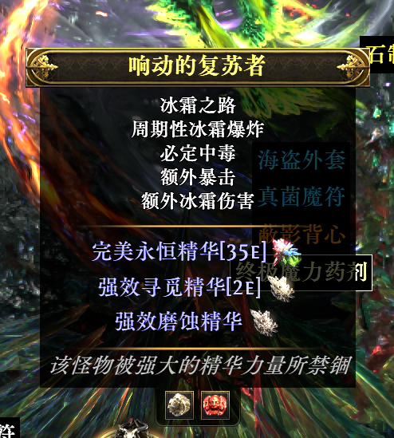
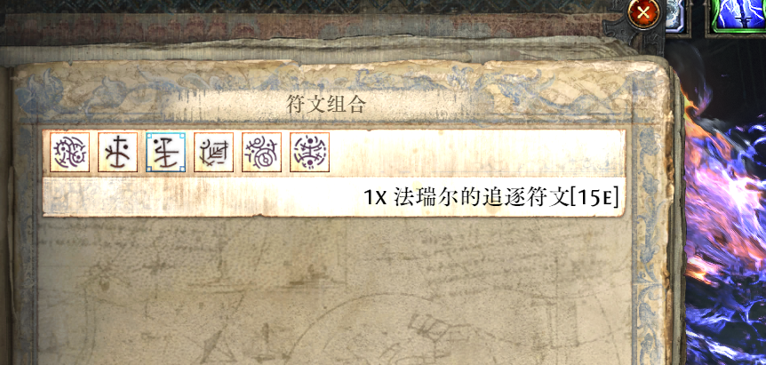

## Poe2PriceGui-介绍

```
POE2 物价补丁GUI版本: 为《Path of Exile 2》国服自动抓取通货物价，查询装备价值工具(实时物价指的是打入补丁那一刻的物价，刷新物价需要自己手动更新，也就是得重新打补丁。)。

注: 本工具仅用于学习和研究，不涉及任何商业用途，目前只支持国服(Wegame)。

工具目前还是一个Alpha版本，可能会有BUG和不完善的地方。

BUG反馈可以加QQ群反馈: 1001850913
```

价格补丁部分参考自开源项目 [weixiao030/poe2\_price](https://github.com/weixiao030/poe2_price)，在此致谢。

查价器部分参考自开源项目 [maxensas/xiletrade](https://github.com/maxensas/xiletrade)，在此致谢。

***

> ⚠️ **重要提示：** 本工具会修改游戏文件，和其他补丁一样**存在封号风险**。使用前请确认自己能接受风险，并在**关闭游戏后**再运行。
>
> API Token 用于访问更稳定的 \_validate API 和查询完整历史价格数据。
>
> 当前可使用限免30天的API KEY（2026-07-15 23点到期）: 789486ce3baf2c4a7e18f4ba0b9aa4ab8edb9da64ca92bca10ca74c094cd8f8d
>
> 如果超过7月15日，请将设置中的API Token删除，走原始API, 后续会针对性的优化价格计算。

***

## 使用方法

```
例:D:\WeGameApps\rail_apps\流放之路：降临(2002052)

游戏道具价格显示:
设置-游戏目录(优先点击自动选择，如果不可以手动复制目录过来)-等待下方检测(显示wegame服，则成功)-价格查看-刷新价格-工具箱-生产补丁并安装

查价器:
设置-查价器-点击登录-点击开关-默认热键(ctrl+d)

Tip:
国服如果提示各种上不去游戏的错误，请检查游戏是否使用过其他补丁，如使用过请先修复游戏，修复游戏后还是无法使用，并且之前启动过其他腾讯国服游戏，请重启电脑后再试。
```

## 更新日志

```
v1.0.5(国际服支持还未完善，未测试)
1. 新增物品品质、护甲、闪避、能量护盾、伤害等属性字段
2. 重构剪贴板复制逻辑，修复输入法兼容问题
3. 新增多种测试用例，支持多类型物品测试
4. 重构搜索字段生成逻辑，支持更多筛选条件
5. 优化赛季选择功能，支持动态获取并校验赛季列表
6. 重构稀有度颜色转换器，兼容多语言与旧版用法
7. 优化悬浮窗UI样式与物品信息展示
8. 新增IPriceService接口抽象价格服务，实现国服poecurrency.top与国际服poe2scout.com双数据源
9. 重构主视图模型，支持自动检测区服、强制切换区服调试功能
10. 新增登录浏览器窗口，适配国际服登录流程
11. 优化交易服务，支持国服/国际服不同API地址与请求头
12. 新增图标直接URL加载逻辑，适配国际服图标获取
13. 新增GGPKExtractor工具与国际服GGPK模式还原逻辑
14. 修复部分UI绑定与状态同步问题
15. 优化备份逻辑
16. 大幅度优化查价器搜索速度(提升3倍以上)

v1.0.4
1.添加清空备份功能。
2.添加安全提示。
3.添加一个未鉴定装备的查价器测试，修复一个查价器错误。

v1.0.3
1.修复查价器登录部分问题(暂时改为手动登录，取消自动登录)。
2.取消设置页面最下方提示。

v1.0.2
1.添加自动更新功能,使用Github Releases更新。

v1.0.1
1.添加除github外的BUG反馈途径。
2.优化readme，添加简易使用方式。

v1.0.0
1.添加GUI界面管理(主界面表格内价格支持手动修复)。
2.获取国服价格方式添加最新过滤异常价格的API(目前已内置最新的API接口，和免费30天试用版的Token, summary_validate接口)。
3.显示优化为1D以下显示为E的单位,1D以上显示为D的单位,低于1E的不显示价格。
4.添加日志系统，记录工具运行时的事件和错误信息。
5.添加查价器功能。

```

## 打包命令

```
old:
dotnet publish -c Release -r win-x64 --self-contained true -p:DebugType=none -p:DebugSymbols=false

new:
1. 安装 vpk CLI 工具（仅需一次）
dotnet tool install -g vpk
2. 发布应用
dotnet publish Poe2PriceGui.csproj -c Release --self-contained -r win-x64 -o .\publish
3. 用 vpk 打包 Velopack 发布包
vpk pack --packId Poe2PriceGui --packVersion 1.0.2 --packDir .\publish --mainExe Poe2PriceGui.exe

```

## 界面预览

***

|            主界面            |           工具箱-补丁           |           游戏效果          |
| :-----------------------: | :------------------------: | :---------------------: |
|  |  |  |

|           游戏效果           |           游戏效果           |
| :----------------------: | :----------------------: |
|  |  |

|            查价器-道具           |            查价器-价格           |             查价器-道具提示            |
| :-------------------------: | :-------------------------: | :-----------------------------: |
|  |  |  |

***

## ⭐ Star 历史

<picture>
  <source media="(prefers-color-scheme: dark)" srcset="https://api.star-history.com/svg?repos=john-worker/Poe2PriceGui&type=Date&theme=dark" />
  <source media="(prefers-color-scheme: light)" srcset="https://api.star-history.com/svg?repos=john-worker/Poe2PriceGui&type=Date" />
  
</picture>
